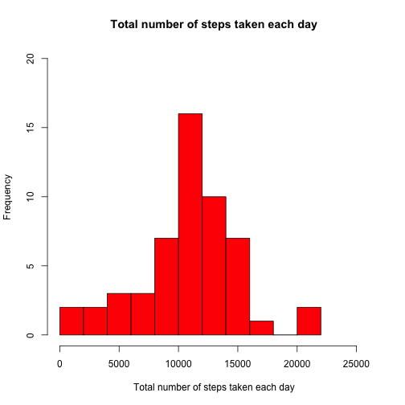
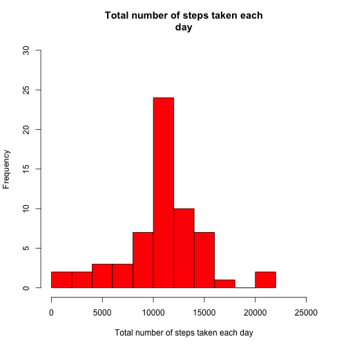
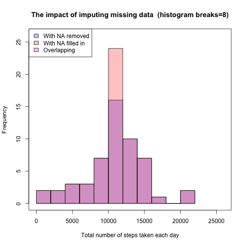
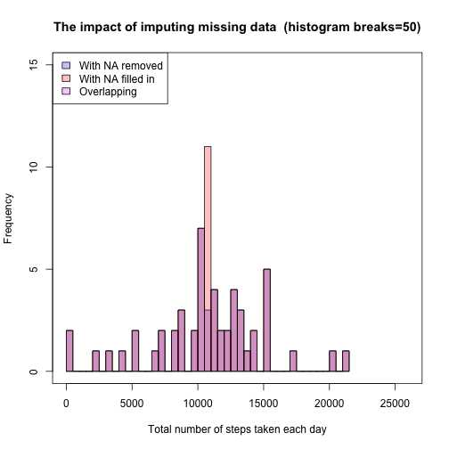
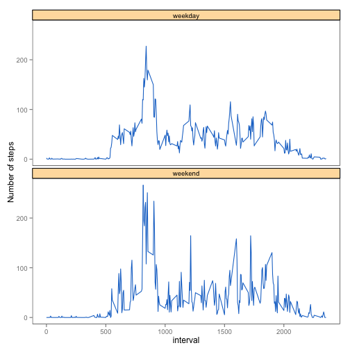

# Reproducible Research: Peer Assessment 1

Set default to echo all code

```r
opts_chunk$set(echo=TRUE)
```


## Loading and preprocessing the data

Load the data (i.e. read.csv())

```r
oridata <- read.csv("activity.csv", header=TRUE, stringsAsFactors=FALSE)
```

Process transform the data (if necessary) into a format suitable for your analysis

```r
oridata$date <- strptime(oridata$date, "%Y-%m-%d")
oridata$date <- as.Date(oridata$date)
dim(oridata)
```

```
## [1] 17568     3
```

```r
head(oridata)
```

```
##   steps       date interval
## 1    NA 2012-10-01        0
## 2    NA 2012-10-01        5
## 3    NA 2012-10-01       10
## 4    NA 2012-10-01       15
## 5    NA 2012-10-01       20
## 6    NA 2012-10-01       25
```


## What is mean total number of steps taken per day?

For this part of the assignment, you can ignore the missing values in the dataset.

```r
complete_data <- oridata[complete.cases(oridata), ]
```


Make a histogram of the total number of steps taken each day

```r
library(sqldf)
```

```
## Loading required package: gsubfn
## Loading required package: proto
## Loading required namespace: tcltk
## Loading required package: RSQLite
## Loading required package: DBI
## Loading required package: RSQLite.extfuns
```

```r
aggdata <- sqldf("select date, ( sum(steps) )total_steps from complete_data group by date")
```

```
## Loading required package: tcltk
```

```r
# verify the total number of steps is correct for one specific date
sum( complete_data [which(complete_data$date == as.Date("2012-10-07") ), ]$steps )  == aggdata $total_steps[aggdata$date==as.Date("2012-10-07") ]
```

```
## [1] TRUE
```

```r
hist(aggdata$total_steps, main = paste("Total number of steps taken each day"), xlab="Total number of steps taken each day", ylab="Frequency", col="red", breaks=8, xlim=c(0,26000), ylim=c(0,20))
```

 


Calculate and report the mean and median total number of steps taken per day:  
The mean total number of steps taken per day is 

```r
mean(aggdata$total_steps)
```

```
## [1] 10766
```
The median total number of steps taken per day is 

```r
median(aggdata$total_steps)
```

```
## [1] 10765
```

## What is the average daily activity pattern?

Make a time series plot (i.e. type = "l") of the 5-minute interval (x-axis) and the average number of steps taken, averaged across all days (y-axis)


```r
interval_arr <- unique(oridata$interval)

mean_steps <- numeric(length(interval_arr))
for ( ind in 1:length(interval_arr) )
  {
     interval <- interval_arr[ind]
     index <- which(oridata$interval == interval)
     mean_steps[ind] <- mean(oridata$steps[index], na.rm=TRUE)
  }
mean_df <- data.frame(interval=interval_arr, mean_steps=mean_steps)


mean_aggdata <- sqldf("select interval, ( avg(steps) )mean_steps from complete_data group by interval")

plot(mean_aggdata$interval, mean_aggdata$mean_steps, type="l", main = paste("Average number of steps taken across all days"), ylab="Average number of steps", xlab="The 5-minute interval")
```

 


Which 5-minute interval, on average across all the days in the dataset, contains the maximum number of steps?


```r
ind <- which(mean_aggdata$mean_steps == max(mean_aggdata$mean_steps))
```
The interval contains the maximum number of steps is:

```r
maxStep_inverval <- mean_aggdata$interval[ind]
maxStep_inverval
```

```
## [1] 835
```

The plot with this interval indicated is

```r
plot(mean_aggdata$interval, mean_aggdata$mean_steps, type="l", main = paste("Average number of steps taken across all days"), ylab="Average number of steps", xlab="The 5-minute interval")
abline(v=maxStep_inverval,col=3,lty=1)
```

 

## Imputing missing values


Calculate and report the total number of missing values in the dataset (i.e. the total number of rows with NAs).   The total number of rows with NAs is 

```r
complete_data <- oridata[complete.cases(oridata), ]
nrow(oridata) - nrow(complete_data)
```

```
## [1] 2304
```


Devise a strategy for filling in all of the missing values in the dataset. The strategy does not need to be sophisticated. For example, you could use the mean/median for that day, or the mean for that 5-minute interval, etc.

In this project, we will use the mean for that 5-minute interval to fill in all the missing values in the dataset. 

```r
mean_aggdata <- sqldf("select interval, ( avg(steps) )mean_steps from complete_data group by interval")
```

Create a new dataset that is equal to the original dataset but with the missing data filled in.

```r
newdata <- oridata
na_ind <- which(is.na(newdata$steps))
for ( i in 1:length(na_ind) )
{
  ind <- na_ind[i]
  interval <- newdata$interval[ind]
  newdata$steps[ind] <- mean_aggdata$mean_steps[ which(mean_aggdata$interval == interval) ]     
}
# no NA data any more
complete_data2 <- newdata[complete.cases(newdata), ]
nrow(oridata) - nrow(complete_data2)
```

```
## [1] 0
```


Make a histogram of the total number of steps taken each day and Calculate and report the mean and median total number of steps taken per day. 


```r
aggdata_noNA <- sqldf("select date, ( sum(steps) )total_steps from newdata group by date")

# verify the total number of steps is correct for one specific date
sum( newdata [which(newdata$date == as.Date("2012-10-07") ), ]$steps )  == aggdata_noNA$total_steps[aggdata_noNA$date==as.Date("2012-10-07") ]
```

```
## [1] TRUE
```

```r
hist(aggdata_noNA$total_steps, main = paste("Total number of steps taken each
day"), xlab="Total number of steps taken each day", ylab="Frequency",
col="red",breaks=8, xlim=c(0,26000), ylim=c(0,30))
```

 


Calculate and report the mean and median total number of steps taken per day:  
The mean total number of steps taken per day is 

```r
mean(aggdata_noNA$total_steps)
```

```
## [1] 10766
```
The median total number of steps taken per day is 

```r
median(aggdata_noNA$total_steps)
```

```
## [1] 10766
```


Do these values differ from the estimates from the first part of the assignment?  What is the impact of imputing missing data on the estimates of the total daily number of steps?

```r
break_num <- 8
color1 <- rgb(0,0,1,1/4)
color2 <- rgb(1,0,0,1/4)
color3 <- rgb(1,0,1,1/4)
p1 <- hist(aggdata$total_steps, breaks=break_num)
p2 <- hist(aggdata_noNA$total_steps, breaks=break_num)
title <- sprintf("The impact of imputing missing data  (histogram breaks=%d)", break_num)
plot(x=1:26000, main = title, xlab="Total number of steps taken each day", ylab="Frequency", xlim=c(0,26000), ylim=c(0,26), type="n")
plot(p1, col=color1, add=T)
plot(p2, col=color2,  add=T)
# abline(v=median_rmNA, col="green", lty=1)
# abline(v=median_fillInNA, col="red", lty=1)
legend("topleft", legend = c("With NA removed", "With NA filled in", "Overlapping"),fill=c(color1, color2, color3))
```

 


```r
break_num <- 50
color1 <- rgb(0,0,1,1/4)
color2 <- rgb(1,0,0,1/4)
color3 <- rgb(1,0,1,1/4)
p1 <- hist(aggdata$total_steps, breaks=break_num)
p2 <- hist(aggdata_noNA$total_steps, breaks=break_num)
title <- sprintf("The impact of imputing missing data  (histogram breaks=%d)", break_num)
plot(x=1:26000, main = title, xlab="Total number of steps taken each day", ylab="Frequency", xlim=c(0,26000), ylim=c(0,15), type="n")
plot(p1, col=color1, add=T)
plot(p2, col=color2,  add=T)
# abline(v=median_rmNA, col="green", lty=1)
# abline(v=median_fillInNA, col="red", lty=1)
legend("topleft", legend = c("With NA removed", "With NA filled in", "Overlapping"),fill=c(color1, color2, color3))
```

 


From the following code, it is clear that filling in missing data makes the value of the total number of steps taken each day availabel for 8 extra days, each with the same total steps of 10766.19.  The total number of steps for those 8 days in the aggregate dataset would be missing otherwise if the missing data is removed.

```r
diffdate <- as.Date(  setdiff(as.character(aggdata_noNA$date), as.character(aggdata$date)) )
diffdate_df <- data.frame(date=diffdate, total_steps=numeric(length(diffdate)) )
for (i in 1:length(diffdate) )
{
    date <- diffdate_df[i, ]$date
    diffdate_df[i, ]$total_steps <- aggdata_noNA[which(aggdata_noNA$date==date), ]$total_steps
}
dim(diffdate_df)
```

```
## [1] 8 2
```

```r
diffdate_df
```

```
##         date total_steps
## 1 2012-10-01       10766
## 2 2012-10-08       10766
## 3 2012-11-01       10766
## 4 2012-11-04       10766
## 5 2012-11-09       10766
## 6 2012-11-10       10766
## 7 2012-11-14       10766
## 8 2012-11-30       10766
```

```r
unique(diffdate_df$total_steps)
```

```
## [1] 10766
```

The difference of mean value is

```r
mean_rmNA <- mean(aggdata$total_steps)
mean_fillInNA <- mean(aggdata_noNA$total_steps)
diff_mean <- mean_rmNA - mean_fillInNA
diff_mean
```

```
## [1] 0
```


The difference of median value is

```r
median_rmNA <- median(aggdata$total_steps)
median_fillInNA <- median(aggdata_noNA$total_steps)
diff_median <- median_rmNA - median_fillInNA
diff_median
```

```
## [1] -1.189
```


## Are there differences in activity patterns between weekdays and weekends?


Create a new factor variable in the dataset with two levels – “weekday” and “weekend” indicating whether a given date is a weekday or weekend day.


```r
newdata$dayinweek <- weekdays(aggdata_noNA$date)
newdata$Type <- ifelse( (newdata$dayinweek=="Saturday"|newdata$dayinweek=="Sunday"), "weekend", "weekday")
newdata$Type <- as.factor( newdata$Type )
```

Make a panel plot containing a time series plot (i.e. type = "l") of the 5-minute interval (x-axis) and the average number of steps taken, averaged across all weekday days or weekend days (y-axis). 


```r
test_data <- sqldf("select interval, ( avg(steps) )avg_steps, Type from newdata group by interval, Type ")
dim(test_data)
```

```
## [1] 576   3
```

```r
head(test_data)
```

```
##   interval avg_steps    Type
## 1        0   2.32746 weekday
## 2        0   0.00000 weekend
## 3        5   0.45283 weekday
## 4        5   0.02123 weekend
## 5       10   0.16436 weekday
## 6       10   0.04127 weekend
```

```r
range(test_data$avg_steps)
```

```
## [1]   0.0 266.6
```

```r
# verify the result is correct for one specific date
mean( newdata [which(newdata$Type == "weekday" & newdata$interval == 0),]$steps) -  test_data$avg_steps[which(test_data$interval==0 & test_data$Type =="weekday")]
```

```
## [1] -4.441e-16
```

```r
mean( newdata [which(newdata$Type == "weekend" & newdata$interval == 0),]$steps)  -  test_data$avg_steps[which(test_data$interval==0 & test_data$Type =="weekend")]
```

```
## [1] 0
```

```r
library(ggplot2)

# ggplot(test_data, aes(interval)) + geom_line(aes(y = avg_steps), colour=colors()[131]) + facet_wrap( ~ Type, ncol=1) + xlab("interval") + ylab("Number of steps")  + theme_bw() + theme(strip.background = element_rect(fill=colors()[486], colour='black', size=0.4)) + theme(panel.grid.major = element_blank(), panel.grid.minor = element_blank())

ggplot(test_data, aes(interval)) + geom_line(aes(y = avg_steps), colour=colors()[131]) + facet_wrap( ~ Type, ncol=1) + xlab("interval") + ylab("Number of steps") + theme(strip.background = element_rect(fill=colors()[486], colour='black')) + theme(panel.background = element_rect(fill='white', colour='black')) + theme(panel.grid.major = element_blank(), panel.grid.minor = element_blank())
```

 

